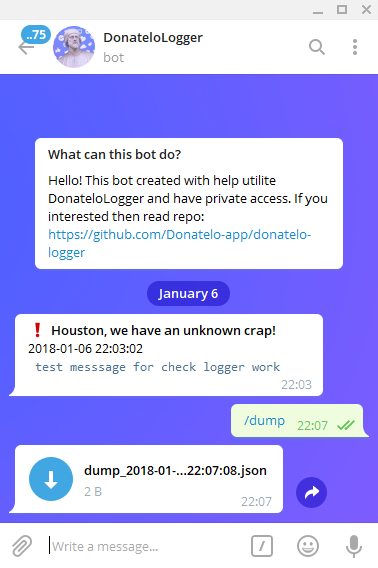

|   |   |
|---|---|
|  | <h2>Donatelo Logger</h2><br> **Простой логгер ошибок с возможностью оповещения через Telegram бота.**  |


# Как запустить
1. Создать `.env` файл с указанием токена вашего бота
и id юзеров, которым будут приходить оповещания об ошибках. Пример:
```
TELEGRAM_BOT_TOKEN=469407242:AAHsVy...
USERS=0000000; 0000000; 0000000
```
2. Установить зависимости: `npm i`
3. Запустить процесс: `node index.js`

# Server API
* **POST /issue: Создает новый лог в базе и сразу же оповещает в телеграме**
```javascript
{
    label: "BACKEND",
    type: 'error', // Типы для эмодзи: log, error, warning
    msg: 'Error',
    db: true // Определяет нужно ли хранить ошибку на сервере или нет. По стандарту true
}
```

* **POST /find: Ищет логи в базе**
```javascript
{
    query: {
      type: "error" // найдет все логи с типом Error
    }
}
```
* **GET /dump: Отдает полный дамп логов за все время**

# Кастомизация
Так же вы можете изменить некоторые данные для своего бота в `setup.json`
```javascript
{
  // порт на котором работает express
  "port": 8080,
  // количество запросов на /issue в минуту для одного IP
  "notifyPerMinute": 1,
  
  // кастомизировать типы и иконки
  "types": {
    "log": "✉️",
    "error": "❗️",
    "warning": "⚠️",
    "default": "❓"
  },
  
  "noAccessMessage": "Sorry, this bot have private access. Try read https://github.com/Donatelo-app/donatelo-logger",
  "defaultLabel": "Houston, we have an unknown crap!",
  "pingMessage": "I'm alive, don't worry :)",
  "startMessage": "Hello! I'm Donatelo Logger and i can notify you about errors, cool? Cool."
}
```
